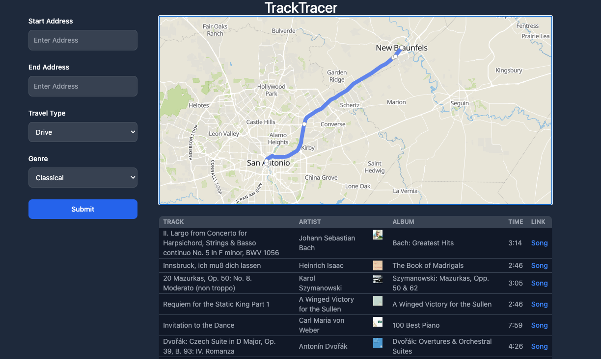

# Track Tracer: Route & Rhythm

## Description

Track Tracer is an fresh new application that fuses navigation with music, ensuring your journey is always jogging.

- **What was your motivation?**
  Drives, runs, strolls, walks; life sounds better with music. And nothing brings closure to a route more than ending a song right as you end your route. Track Tracer was born from this desire.

- **Why did you build this project?**
  To create a seamless experience for anyone who wants to optimize their travel or exercise routes with music, turning every journey into a expertly-timed playlist.

- **What problem does it solve?**
  Eliminates the headache and time requirement of creating, pausing, interrupting a playlist.

- **What did you learn?**
  Integration of two distinct APIs, understanding the blend of two different API's, and learning how to two separate ideas create a third.

## Table of Contents

- [Installation](#installation)
- [Usage](#usage)
- [Credits](#credits)
- [License](#license)

## Installation

1. Open up your browser and visit: https://andrewtullos.github.io/GroupTenProject1/
2. Enter in your route and destination
3. Enjoy your playlist & directions

## Credits

- [MapLibre API](https://maplibre.org/)
- [GeoApify API](https://www.geoapify.com/)
- [Spotify API](https://developer.spotify.com/documentation/web-api/)

## Contributors

- Brandon Mullins - [GitHub](https://github.com/WebDevMullins)
- Austin Mann - [GitHub](https://github.com/ammann64)
- Catherine Parker - [GitHub](https://github.com/caparker23)
- Andrew Tullos - [GitHub](https://github.com/AndrewTullos)

## License

This project is licensed under the MIT License. For more details, please refer to [https://choosealicense.com/licenses/mit/](https://choosealicense.com/licenses/mit/).

---

## Features

- **Route Time Estimation:** Uses advanced algorithms to accurately predict the time taken for any route.
- **Music Genre Selection:** Choose the genre of music you want for your journey.

## Badges

